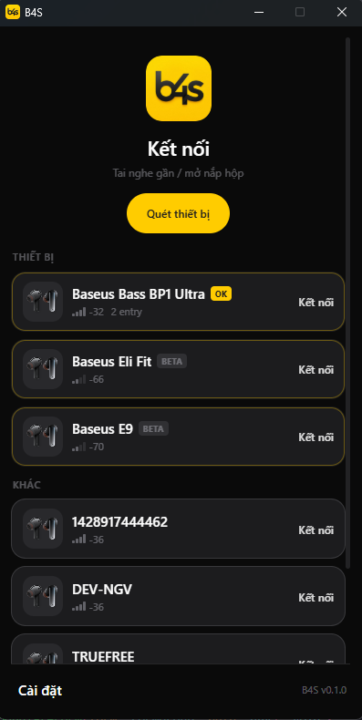
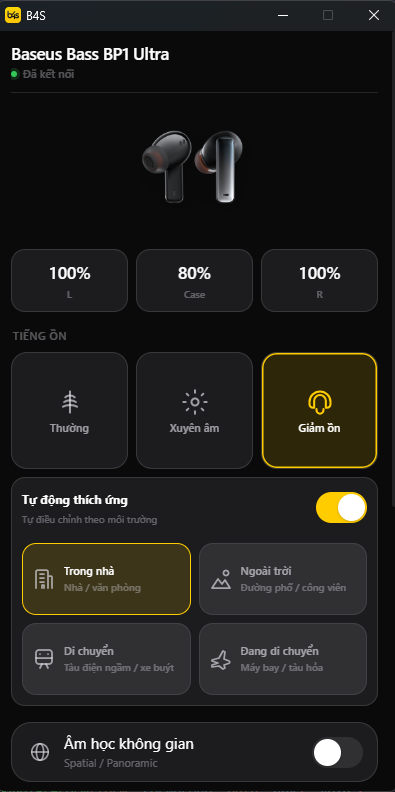
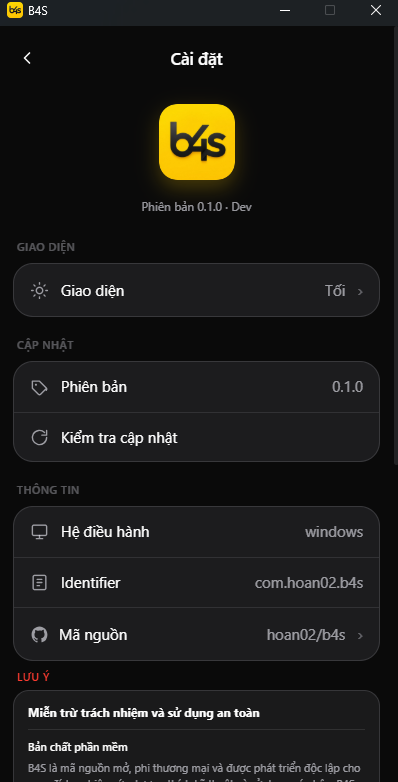

# B4S

B4S là ứng dụng desktop độc lập để kết nối và điều khiển một số mẫu tai nghe Bluetooth LE trên Windows, macOS và Linux.

| Quét & kết nối | Điều khiển thiết bị | Cài đặt |
|---|---|---|
|  |  |  |

## Tình trạng hỗ trợ hiện tại

Hiện tại phần cứng kiểm thử chính là **Baseus Bass BP1 Ultra**. Thiết bị này thuộc họ giao thức **BP1**; BP1 Pro và các model cùng họ có thể dùng chung family adapter nhưng vẫn phải có profile và kiểm thử riêng. Các model khác mới ở mức nhận diện catalog hoặc thử nghiệm, chưa được bảo đảm hoạt động đầy đủ.

| Mức hỗ trợ | Ý nghĩa |
|---|---|
| Đã xác minh | Đã kiểm tra frame và chức năng trên phần cứng thực tế |
| Thử nghiệm | Có profile hoặc giao thức tương tự, cần kiểm tra thêm trên từng firmware |
| Chỉ nhận diện | Chỉ nhận biết tên thiết bị, chưa bật điều khiển |

Không nên xem các model ngoài BP1 Ultra là đã được hỗ trợ hoàn chỉnh.

## Chức năng

- Quét và kết nối Bluetooth LE.
- Hiển thị pin trái, phải và hộp khi thiết bị cung cấp dữ liệu.
- Chế độ bình thường, xuyên âm và giảm tiếng ồn.
- ANC thích ứng với các môi trường được profile hỗ trợ.
- EQ preset và EQ custom theo profile model.
- Âm thanh không gian, game mode và tìm tai nghe khi firmware hỗ trợ.
- Giao diện sáng/tối và kiểm tra cập nhật.

Một số chức năng có thể không tồn tại trên từng model hoặc firmware. B4S sẽ không tự gửi lệnh chưa được xác minh cho model chưa đủ thông tin.

## Cài đặt chạy thử

Yêu cầu:

- Node.js 18 trở lên.
- Rust stable và Cargo.
- Bluetooth được bật trên hệ điều hành.
- Tai nghe ở chế độ ghép nối hoặc đang mở hộp.

```bash
npm install
npm run tauri:dev
```

Ứng dụng hỗ trợ Windows, macOS và Linux thông qua btleplug. Trạng thái Bluetooth được kiểm tra theo adapter của từng nền tảng; khi hệ điều hành trả về trạng thái chưa xác định, app dùng phép thử scan dự phòng.

## Kiến trúc

- `src/`: giao diện SolidJS, trạng thái thiết bị và profile frontend.
- `src-tauri/src/ble.rs`: scan, connect, GATT và event.
- `src-tauri/src/protocol/`: frame và protocol family.
- `src-tauri/catalog/`: profile model, capability, ANC, EQ và ảnh.
- `docs/model-catalog.md`: hướng dẫn thêm model mới.

## Miễn trừ trách nhiệm và sử dụng an toàn

B4S là phần mềm độc lập, không chính thức, không được tài trợ, chứng nhận hoặc liên kết với Baseus hay bất kỳ nhà sản xuất tai nghe nào. Tên sản phẩm, tên model và nhãn hiệu thuộc về chủ sở hữu tương ứng và chỉ được dùng để nhận diện khả năng tương thích.

B4S là mã nguồn mở, phi thương mại và được thiết kế để xử lý chức năng điều khiển cục bộ qua Bluetooth. Ứng dụng không yêu cầu tài khoản và không chủ động thu thập hoặc gửi dữ liệu sử dụng, dữ liệu thiết bị hay thông tin cá nhân về máy chủ. Chức năng điều khiển có thể dùng offline; việc kiểm tra cập nhật hoặc mở liên kết ngoài do người dùng chủ động thực hiện có thể cần Internet.

B4S hiện dùng Baseus Bass BP1 Ultra làm mẫu kiểm thử chính thuộc họ BP1. Việc hiển thị hoặc nhận diện BP1 Pro hay model khác không đồng nghĩa model đó được nhà phát triển xác minh hoặc được nhà sản xuất hỗ trợ.

Người dùng tự chịu trách nhiệm khi kết nối, cập nhật firmware, thay đổi âm lượng, EQ, ANC, âm thanh không gian hoặc sử dụng chức năng tìm tai nghe. Chức năng tìm tai nghe có thể phát âm thanh lớn; hãy tháo tai nghe khỏi tai trước khi xác nhận. Không sử dụng nếu cảm thấy đau, ù tai hoặc khó chịu.

B4S được cung cấp theo hiện trạng, không bảo đảm tương thích, tính liên tục, độ chính xác của dữ liệu, an toàn phần cứng, khả năng khôi phục firmware hoặc hoạt động không gián đoạn. Nhà phát triển không chịu trách nhiệm cho mất dữ liệu, hư hỏng thiết bị, ảnh hưởng thính giác hoặc thiệt hại phát sinh từ việc sử dụng phần mềm.

Không đưa APK chính thức, khóa riêng, dữ liệu tài khoản, firmware hoặc bản decompile có bản quyền vào repository. Chỉ sử dụng dữ liệu protocol và profile cần thiết cho mục đích tương thích kỹ thuật độc lập. Người dùng cần tuân thủ pháp luật, điều khoản thiết bị và quyền sở hữu trí tuệ tại nơi sử dụng.

## License

MIT
