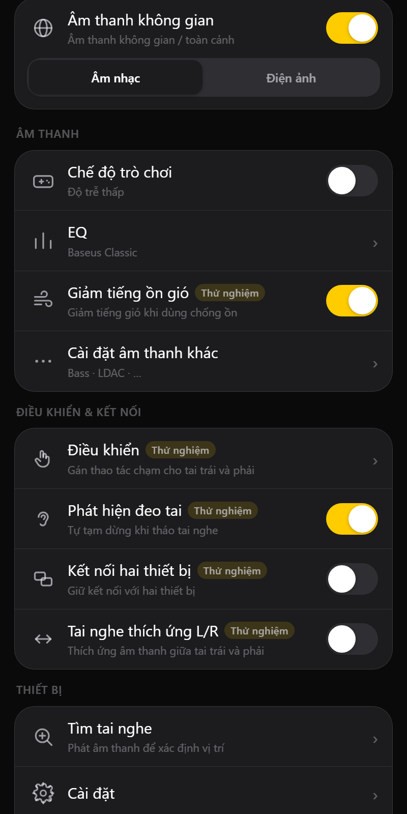

# B4S: unofficial Baseus earbuds app for Windows, macOS and Linux

English | [Tiếng Việt](README.vi.md) | [Español](README.es.md) | [简体中文](README.zh-CN.md) | [Português (Brasil)](README.pt-BR.md)

**B4S is a free, open-source desktop app that controls Baseus Bluetooth LE earbuds from your PC.**
Switch noise cancelling (ANC), transparency and adaptive modes, adjust the EQ,
turn on spatial audio and game mode, and read battery levels without the Baseus
phone app. It works with the **Baseus Bass BP1 Pro** and **BP1 Ultra**, with
experimental profiles for the **EP10 Ultra, EP10 Pro, Bowie M4s, Bowie MS1 and
Bowie M3s**. Built with SolidJS, Tauri and Rust.

[**Download the latest installer**](https://github.com/hoan02/b4s/releases/latest) · [Supported earbuds](#supported-baseus-earbuds) · [FAQ](#faq)

| Scan and connect | Device controls | More controls | Settings |
|---|---|---|---|
|  |  |  |  |

Screenshots show the Vietnamese interface. The control screens were rendered from the app's own components with sample data.

## What is new in 0.1.3

The catalog embeds 124 headphone profiles, including 122 recognition-only models. Product names and images use public metadata; thumbnails and large photos are cached locally (64 MiB) for reuse offline. Model IDs are normalized and saved identities/EQ are migrated automatically.

Users of 0.1.1/0.1.2 must install 0.1.3 manually once because the updater signing key changed.

[Changelog](CHANGELOG.md) · [Model contract](docs/model-identity-presentation.md) · [Image cache](docs/product-image-cache.md)

## Supported Baseus earbuds

B4S only enables controls for earbuds that have a reviewed profile. A name match
alone never turns a control on.

| Baseus model | Support level | What you can control |
|---|---|---|
| Bass BP1 Pro | Reviewed profile | ANC, transparency and adaptive modes, EQ presets and custom EQ, spatial audio, game mode, bass boost, find earbuds |
| Bass BP1 Ultra | Experimental, tested on Windows | Battery, ANC, game mode, spatial audio, bass boost, LDAC, hearing protection, gestures. EQ/SoundFit unavailable |
| Bass EP10 Ultra, Bowie M4s, Bowie MS1 | Experimental, not tested on hardware | Same controls as BP1 Ultra (shared adapter) |
| Bass EP10 Pro, Bowie M3s | Experimental, not tested on hardware | ANC, spatial audio, game mode, bass boost, gestures, wind noise reduction (EP10 Pro also has EQ presets) |
| 117 other Baseus models in the catalog | Recognition only | Name and image in the device list, no controls |

Some controls (touch gestures, in-ear detection, multipoint, wind noise
reduction, adaptive L/R, restore defaults) are marked **Experimental** in the
app and follow *Settings → Experimental mode*. Controls vary by model and
firmware.

### Support levels

| Level | Meaning |
|---|---|
| Verified | Commands and behavior have been checked on real hardware. |
| Experimental | A protocol profile exists, but model or firmware behavior needs more testing. |
| Scan only | The app recognizes the device; control is not enabled. |

See [the model catalog](docs/model-catalog.md) and [protocol notes](docs/protocol/overview.md).

## Features

- Scan for and connect to Bluetooth LE earbuds.
- Optionally reconnect to the last supported earbuds once at startup. Turn on
  **Reconnect automatically** in Settings; it is off by default. B4S searches
  for up to 12 seconds before falling back to manual selection. The earbuds
  must expose their BLE control service; a Windows audio connection alone does
  not guarantee this.
- Show left, right and case battery levels when the device reports them.
- Control noise cancellation, transparency and supported listening modes.
- Adjust EQ presets and custom EQ where the model profile allows it.
- Use spatial audio, game mode, bass boost and find-earbuds controls on supported models.
- Try experimental controls such as touch gestures, in-ear detection, multipoint,
  wind noise reduction and adaptive L/R earbuds on models that declare them.
- Choose a light or dark theme and check for app updates.
- Optionally start at sign-in. Closing the window hides B4S to the system tray
  when the tray is available; use **Quit B4S** in the tray menu to exit.

Controls vary by model and firmware. B4S avoids sending unsupported commands
when the profile does not provide the required capability.

## Development

Requirements: Bun 1.4.0, Rust stable, the Tauri platform prerequisites, and
Bluetooth hardware for device testing. Install dependencies and start the app:

```sh
bun install --frozen-lockfile
bun run tauri:dev
```

Before submitting changes, run the checks in [Contributing](CONTRIBUTING.md).

## FAQ

**Is there a Baseus app for Windows or PC?**
Baseus publishes its official app for phones. B4S is an independent, unofficial
desktop app that covers the earbud controls above on Windows, macOS and Linux.
Windows is the platform used for testing so far.

**Can I change Baseus noise cancelling (ANC) or EQ from a computer?**
Yes, on supported models: connect over Bluetooth LE, then switch ANC,
transparency or adaptive mode and pick an EQ preset in B4S.

**Does it work with my Baseus earbuds?**
Check [Supported Baseus earbuds](#supported-baseus-earbuds). B4S recognizes 124
Baseus headphone models, but only the models in that table have controls.

**Why can B4S not find or control my earbuds on Windows?**
Windows often lists the same earbuds twice (audio endpoint and BLE control
entry). Pick the entry marked **Control**. See the
[troubleshooting guide](docs/desktop-troubleshooting.md).

**Is it safe, and does it send my data anywhere?**
Controls run locally over Bluetooth. B4S needs no account and sends no device or
personal data to a server. Read the [disclaimer](#disclaimer-and-safe-use).

## Languages

The app starts in English and includes Vietnamese, Simplified Chinese, Spanish
and Brazilian Portuguese. Change the language in **Settings**. Translations are
bundled with the app and work offline. See the [translation guide](docs/translations.md)
to improve an existing locale or contribute another one.

## Project guides

- [Contributing](CONTRIBUTING.md)
- [Architecture and extension points](docs/architecture.md)
- [Adding a model or protocol family](docs/model-catalog.md)
- [Protocol overview](docs/protocol/overview.md)
- [Release and auto-update](docs/release.md)
- [Desktop troubleshooting and diagnostics](docs/desktop-troubleshooting.md)

## Disclaimer and safe use

B4S is independent, non-commercial open-source software. It is not sponsored,
certified or officially affiliated with Baseus or any earbud manufacturer.
Product names and trademarks belong to their respective owners and are used
only to identify compatibility.

Device controls run locally over Bluetooth. The app does not require an account
or send device or personal data to a server. Internet access is only needed for
actions you initiate, such as checking for updates or opening an external link.

You are responsible for device connections, firmware updates and changes to
volume, EQ, ANC or spatial audio. Find-earbuds may play a loud sound: remove the
earbuds before using it. Stop if you feel pain, ringing or discomfort. B4S is
provided as-is and does not guarantee compatibility, uninterrupted operation,
hardware safety or firmware recovery.

Do not add official APKs, private keys, account data, firmware or copyrighted
decompiled source to this repository. Follow applicable laws, device terms and
intellectual-property rights.

## License

MIT
