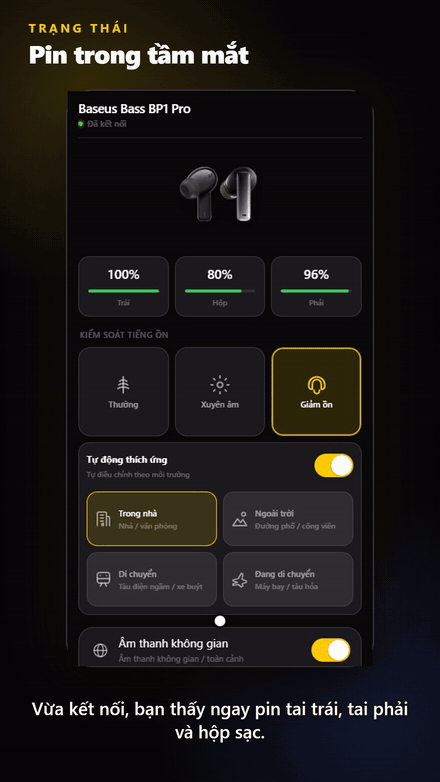

# B4S: ứng dụng Baseus không chính thức cho Windows, macOS và Linux

[English](README.md) | Tiếng Việt | [Español](README.es.md) | [简体中文](README.zh-CN.md) | [Português (Brasil)](README.pt-BR.md)

**B4S là ứng dụng desktop miễn phí, mã nguồn mở, dùng để điều khiển tai nghe Bluetooth LE Baseus ngay trên máy tính.**
Bật/tắt chống ồn (ANC), xuyên âm và chế độ thích ứng, chỉnh EQ, dùng âm thanh
không gian, chế độ game và xem pin mà không cần ứng dụng Baseus trên điện thoại.
Hỗ trợ **Baseus Bass BP1 Pro** và **BP1 Ultra**, cùng profile thử nghiệm cho
**EP10 Ultra, EP10 Pro, Bowie M4s, Bowie MS1 và Bowie M3s**. Xây dựng bằng
SolidJS, Tauri và Rust.

[**Tải bản cài đặt mới nhất**](https://github.com/hoan02/b4s/releases/latest) · [Tai nghe được hỗ trợ](#tai-nghe-baseus-được-hỗ-trợ) · [Hỏi đáp](#hỏi-đáp)

<p align="center"><a href="assets/b4s-demo.mp4"></a></p>

<p align="center"><sub>Xem trước ứng dụng với giao diện tiếng Việt và dữ liệu mẫu. <a href="assets/b4s-demo.mp4">Xem video đầy đủ có thuyết minh (tiếng Việt, ~75 giây)</a>.</sub></p>

## Điểm mới trong 0.1.3

Catalog có 124 profile tai nghe, gồm 122 model chỉ nhận diện. Tên và ảnh sản phẩm dùng metadata công khai; ảnh nhỏ và ảnh lớn được lưu cache trên máy (64 MiB) để dùng lại khi offline. ID model được thống nhất và dữ liệu thiết bị/EQ đã lưu được chuyển đổi tự động.

Người dùng 0.1.1/0.1.2 cần cài thủ công 0.1.3 một lần vì khóa ký updater đã đổi.

[Changelog](CHANGELOG.md) · [Model contract](docs/model-identity-presentation.md) · [Image cache](docs/product-image-cache.md)

## Tai nghe Baseus được hỗ trợ

B4S chỉ bật điều khiển cho tai nghe đã có profile được rà soát. Chỉ khớp tên
thiết bị thì không bao giờ tự bật chức năng.

| Model Baseus | Mức hỗ trợ | Điều khiển được |
|---|---|---|
| Bass BP1 Pro | Profile đã rà soát | ANC, xuyên âm, chế độ thích ứng, EQ preset và EQ tùy chỉnh, âm thanh không gian, chế độ game, bass boost, tìm tai nghe |
| Bass BP1 Ultra | Thử nghiệm, đã thử trên Windows | Pin, ANC, chế độ game, âm thanh không gian, bass boost, LDAC, bảo vệ thính giác, thao tác chạm. Chưa có EQ/SoundFit |
| Bass EP10 Ultra, Bowie M4s, Bowie MS1 | Thử nghiệm, chưa thử trên phần cứng | Giống BP1 Ultra (dùng chung adapter) |
| Bass EP10 Pro, Bowie M3s | Thử nghiệm, chưa thử trên phần cứng | ANC, âm thanh không gian, chế độ game, bass boost, thao tác chạm, giảm tiếng ồn gió (EP10 Pro có thêm EQ preset) |
| 117 model Baseus khác trong catalog | Chỉ nhận diện | Hiện tên và ảnh trong danh sách, không có điều khiển |

Một số điều khiển (thao tác chạm, phát hiện đeo tai, kết nối hai thiết bị, giảm
tiếng ồn gió, tai nghe thích ứng L/R, khôi phục mặc định) được gắn nhãn
**Thử nghiệm** trong ứng dụng và phụ thuộc *Cài đặt → Chế độ thử nghiệm*. Chức
năng thay đổi theo model và firmware.

### Mức hỗ trợ

| Mức hỗ trợ | Ý nghĩa |
|---|---|
| Đã xác minh | Lệnh và hành vi đã được kiểm tra trên phần cứng thực tế. |
| Thử nghiệm | Đã có profile giao thức nhưng cần kiểm tra thêm model hoặc firmware. |
| Chỉ nhận diện | Ứng dụng nhận ra thiết bị nhưng chưa bật điều khiển. |

Xem [catalog model](docs/model-catalog.md) và [ghi chú giao thức](docs/protocol/overview.md).

## Chức năng

- Quét và kết nối tai nghe Bluetooth LE.
- Có thể bật **Tự động kết nối lại** trong Settings để tìm tai nghe được hỗ trợ
  gần nhất một lần khi mở ứng dụng; mặc định tắt. B4S quét tối đa 12 giây rồi
  chuyển sang chọn thủ công. Tai nghe cần có dịch vụ điều khiển BLE; kết nối âm
  thanh Windows không đảm bảo điều đó.
- Hiển thị pin trái, phải và hộp sạc khi thiết bị gửi dữ liệu.
- Điều khiển chống ồn, xuyên âm và các chế độ nghe được hỗ trợ.
- Chỉnh EQ preset và EQ tùy chỉnh khi profile model cho phép.
- Dùng âm thanh không gian, chế độ game, bass boost và tìm tai nghe trên model tương thích.
- Dùng thử các điều khiển thử nghiệm như thao tác chạm, phát hiện đeo tai, kết nối
  hai thiết bị, giảm tiếng ồn gió và tai nghe thích ứng L/R trên model có khai báo.
- Chọn giao diện sáng/tối và kiểm tra cập nhật ứng dụng.
- Có thể bật khởi động cùng lúc đăng nhập. Đóng cửa sổ sẽ ẩn B4S vào khay hệ
  thống khi khay khả dụng; chọn **Quit B4S** trong menu khay để thoát.

Chức năng thay đổi theo model và firmware. B4S tránh gửi lệnh chưa được hỗ trợ
khi profile không khai báo capability tương ứng.

Nếu không thể quét hoặc kết nối, xem [hướng dẫn xử lý sự cố desktop](docs/desktop-troubleshooting.md).

## Phát triển

Cần Bun 1.4.0, Rust stable, các thành phần cần thiết của Tauri trên hệ điều hành
và tai nghe Bluetooth để kiểm thử thiết bị. Cài dependencies rồi chạy ứng dụng:

```sh
bun install --frozen-lockfile
bun run tauri:dev
```

Trước khi gửi thay đổi, hãy chạy các bước trong [hướng dẫn đóng góp](CONTRIBUTING.md).

## Hỏi đáp

**Có ứng dụng Baseus cho Windows hoặc máy tính không?**
Baseus phát hành ứng dụng chính thức cho điện thoại. B4S là ứng dụng desktop độc
lập, không chính thức, cung cấp các điều khiển tai nghe ở trên trên Windows,
macOS và Linux. Hiện Windows là nền tảng đã được dùng để kiểm thử.

**Có thể chỉnh chống ồn (ANC) hoặc EQ của tai nghe Baseus từ máy tính không?**
Có, với model được hỗ trợ: kết nối qua Bluetooth LE rồi đổi chế độ ANC, xuyên âm,
thích ứng hoặc chọn EQ preset trong B4S.

**Tai nghe Baseus của tôi có dùng được không?**
Xem mục [Tai nghe Baseus được hỗ trợ](#tai-nghe-baseus-được-hỗ-trợ). B4S nhận
diện 124 model tai nghe Baseus nhưng chỉ các model trong bảng đó mới có điều khiển.

**Vì sao B4S không tìm thấy hoặc không điều khiển được tai nghe trên Windows?**
Windows thường liệt kê cùng một tai nghe hai lần (cổng âm thanh và cổng điều
khiển BLE). Hãy chọn mục có nhãn **Control**. Xem
[hướng dẫn xử lý sự cố](docs/desktop-troubleshooting.md).

**Ứng dụng có an toàn và có gửi dữ liệu của tôi đi đâu không?**
Điều khiển chạy cục bộ qua Bluetooth. B4S không cần tài khoản và không gửi dữ
liệu thiết bị hay cá nhân lên máy chủ. Đọc phần
[miễn trừ trách nhiệm](#miễn-trừ-trách-nhiệm-và-sử-dụng-an-toàn).

## Ngôn ngữ

Ứng dụng mặc định dùng tiếng Anh và có tiếng Việt, Trung giản thể, Tây Ban Nha
và Bồ Đào Nha Brazil. Có thể đổi ngôn ngữ trong **Settings**. Bản dịch được đóng
gói cùng ứng dụng và dùng được ngoại tuyến. Xem [hướng dẫn dịch](docs/translations.md)
để cải thiện locale hiện có hoặc đóng góp ngôn ngữ mới.

## Tài liệu dự án

- [Hướng dẫn đóng góp](CONTRIBUTING.md)
- [Kiến trúc và điểm mở rộng](docs/architecture.md)
- [Thêm model hoặc họ giao thức](docs/model-catalog.md)
- [Tổng quan giao thức](docs/protocol/overview.md)
- [Phát hành và cập nhật](docs/release.md)

## Miễn trừ trách nhiệm và sử dụng an toàn

B4S là phần mềm mã nguồn mở độc lập, phi thương mại, không được Baseus hay nhà
sản xuất tai nghe tài trợ, chứng nhận hoặc liên kết chính thức. Tên sản phẩm và
nhãn hiệu thuộc về chủ sở hữu tương ứng và chỉ dùng để nhận diện khả năng tương
thích.

Điều khiển thiết bị chạy cục bộ qua Bluetooth. Ứng dụng không yêu cầu tài khoản
và không gửi dữ liệu thiết bị hoặc dữ liệu cá nhân lên máy chủ. Chỉ các thao tác
do bạn chủ động thực hiện, như kiểm tra cập nhật hay mở liên kết ngoài, mới cần
Internet.

Bạn tự chịu trách nhiệm về kết nối, cập nhật firmware và thay đổi âm lượng, EQ,
ANC hoặc âm thanh không gian. Tính năng tìm tai nghe có thể phát âm thanh lớn:
hãy tháo tai nghe khỏi tai trước khi dùng. Dừng lại nếu thấy đau, ù tai hoặc khó
chịu. B4S được cung cấp theo hiện trạng, không bảo đảm tương thích, hoạt động liên
tục, an toàn phần cứng hoặc khôi phục firmware.

Không đưa APK chính thức, khóa riêng, dữ liệu tài khoản, firmware hoặc mã nguồn
decompile có bản quyền vào repository. Hãy tuân thủ luật, điều khoản thiết bị và
quyền sở hữu trí tuệ hiện hành.

## Giấy phép

MIT
