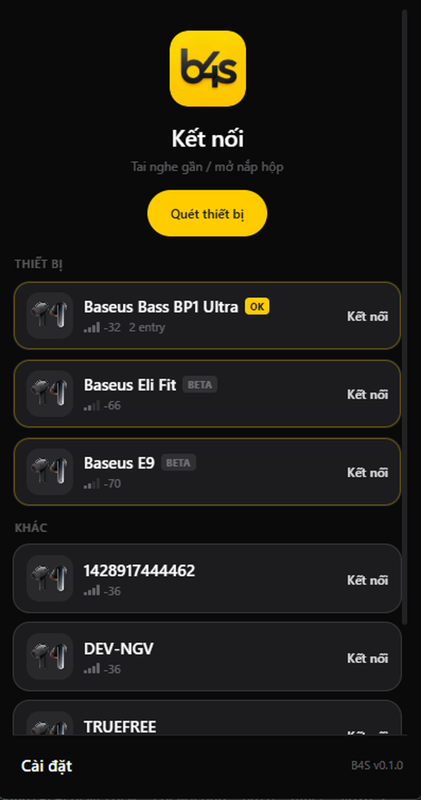
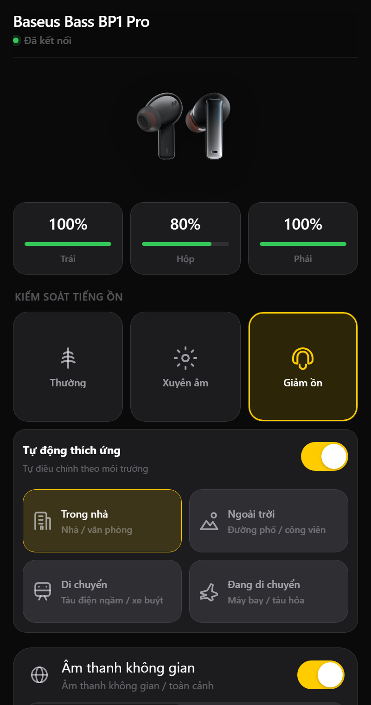
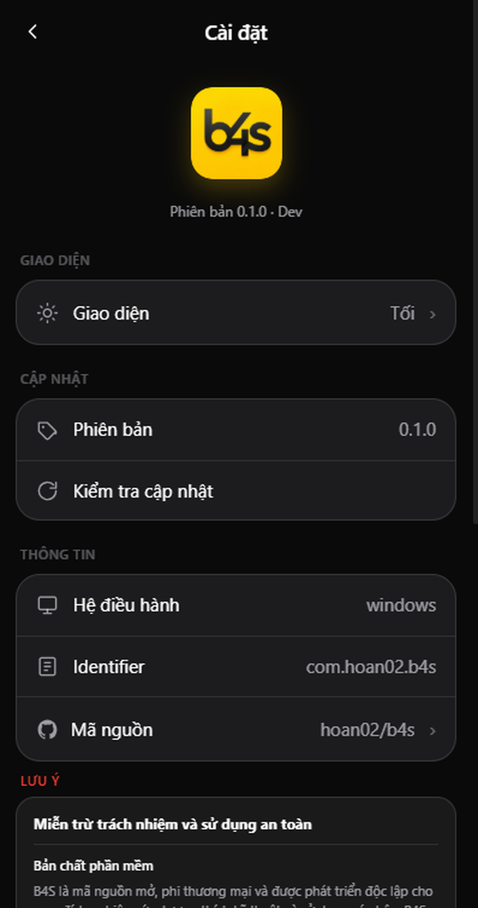

# B4S

[English](README.md) | [Tiếng Việt](README.vi.md) | [Español](README.es.md) | 简体中文 | [Português (Brasil)](README.pt-BR.md)

B4S 是一款独立的桌面应用，可在 Windows、macOS 和 Linux 上控制部分蓝牙 LE
耳机。应用使用 SolidJS、Tauri 和 Rust 构建。

| 扫描并连接 | 设备控制 | 设置 |
|---|---|---|
|  |  |  |

截图展示的是越南语界面。

## 设备支持

BP1 Pro 有经过审查的型号配置。BP1 Ultra 实验性支持 BLE/789C 连接和电量显示，
现已支持实验性 ANC、游戏模式、空间音频、Bass Boost、LDAC、听力保护和触控设置。EQ/SoundFit 尚不可用。目录中的其他型号可能处于实验阶段或仅可识别。
应用识别出设备名称并不代表控制功能已通过验证。

| 支持级别 | 含义 |
|---|---|
| 已验证 | 已在真实硬件上检查命令和行为。 |
| 实验性 | 已有协议配置，但仍需测试具体型号或固件。 |
| 仅识别 | 应用可以识别设备，但尚未启用控制功能。 |

请查看[型号目录](docs/model-catalog.md)和[协议说明](docs/protocol/overview.md)。

## 功能与开发

在设备支持时，B4S 可以显示左右耳机和充电盒电量，并控制降噪、通透、
均衡器、空间音频、游戏模式和耳机定位。你可以在 **Settings** 中开启自动
重连，应用启动时会搜索一次上次使用的受支持耳机；默认关闭，搜索最长
12 秒。也可以设置登录时启动 B4S。关闭窗口会在系统托盘可用时隐藏 B4S；
选择托盘菜单中的 **Quit B4S** 退出。功能因型号和固件而异。

无法扫描或连接时，请参阅[桌面故障排除指南](docs/desktop-troubleshooting.md)。

开发需要 Node.js 20、Rust stable、对应平台的 Tauri 依赖；测试设备功能
还需要蓝牙耳机：

```sh
npm ci
npm run tauri:dev
```

应用默认使用英语，并提供越南语、简体中文、西班牙语和巴西葡萄牙语。
可在 **Settings** 中切换语言；翻译已打包，可离线使用。请参阅[翻译指南](docs/translations.md)
参与翻译。

## 文档

- [贡献指南](CONTRIBUTING.md)
- [架构](docs/architecture.md)
- [添加型号](docs/model-catalog.md)
- [发布与自动更新](docs/release.md)

## 安全与许可

B4S 是独立软件，未与 Baseus 或任何耳机制造商建立官方关联。设备控制
通过蓝牙在本地运行。定位耳机功能可能播放较大音量的声音，请先摘下耳机。
软件按现状提供，不保证兼容性、持续运行或固件恢复能力。

请勿将官方 APK、私钥、固件或受版权保护的反编译代码提交到仓库。许可证：MIT。
