# Standard model architecture

Implemented 2026-10-07 using the APK's separation between device identity,
model-specific configuration, transport selection and feature managers. This
refactor standardizes contracts; it does not claim APK feature parity or add
controls for unreviewed models.

## Boundaries

```mermaid
flowchart LR
  APK[APK and public metadata] --> Evidence[Ignored extraction evidence]
  Evidence --> Review[Model and firmware review]
  Review --> Catalog[Schema 3 reviewed catalog]
  Catalog --> Validation[Catalog validation]
  Validation --> Profile[Typed runtime profile]
  Profile --> Auth[Feature authorization]
  Auth --> Constraints[Feature value constraints]
  Constraints --> Adapter[Protocol family encoder]
  Adapter --> Transport[Declared framing and GATT transport]
  Transport --> Decoder[Family state decoder]
  Decoder --> Confirmation[State confirmation and snapshot]
```

`catalog/types.rs` contains model data. `catalog/validation.rs` validates the
entire catalog before use. `catalog/features.rs` defines control feature keys;
`catalog/evidence.rs` defines knowledge states for 22 feature areas, including
unimplemented APK features. `device/capability.rs` remains the authority for
control admission. `protocol/constraints.rs` validates command values against
reviewed schemas; `protocol/router.rs` dispatches to family encoding/decoding.
The frontend validates model contracts at the bridge in `modelContracts.ts`.

## Schema 3 changes

| Concern | Previous behavior | Current contract |
| --- | --- | --- |
| Bass range | UI/router selected 1 or 5 from the protocol | `sound.maxBassLevel` supplies the model range; catalog rejects a range the adapter cannot encode |
| Custom EQ target | Frontend/router hardcoded slot 101 and no ANC bank | `eq.customWrite.slot/ancBank` supplies the reviewed target; unsupported bank/slot rejected |
| EQ Q values | Missing values could become Q=1 | One explicit positive finite Q value per band; missing values rejected |
| ANC maximum | Frontend converted positive values to 3 or 5 | Uses the actual model value; backend checks requested range |
| Gesture contract | Layout/function list alone | Explicit `gesture.protocol`; Legacy implemented, V2 rejected until its adapter exists |
| Feature knowledge | A false capability did not explain unknown vs absent | Per-feature `unknown`, `unsupported`, `sourceReviewed`, `implemented`, `hardwareVerified` with provenance and firmware scope |
| Unknown family/support | Projection could silently select passive defaults | Catalog rejects unregistered values; projection accepts only validated names |
| Model bridge | Type assertion accepted unvalidated model data | Rejects obsolete schema and missing sound, EQ or evidence contracts; startup reports loading errors |

Model schema 2 is intentionally rejected. Both existing embedded control profiles
were migrated together. Snapshot and command contract versions are unchanged:
their existing state/intent semantics remain valid; runtime profile sound and
evidence data are additive. There is no fallback to another model, UUID, protocol,
Q value or EQ slot when constraints are missing.

The transport/framing contract remains explicit and independently reviewed.
Classic Bluetooth and gesture V2 are not implemented by declaring their names
in evidence. Existing Pro/Ultra GATT, wrapping, query, write and confirmation
behavior stays within the existing acceptance scope.

## Evidence versus permission

Every schema 3 model records all 22 feature areas. Existing enabled features are
marked `implemented` with references to existing implementation/provenance;
this migration does not upgrade them to `hardwareVerified`. Features not reviewed
remain `unknown`, not `unsupported`. Empty firmware evidence lists mean scope is
unknown, not universal firmware support. Exact model references or gesture
configuration extracted from the APK do not establish per-feature review.

Enabled capabilities require an implemented contract and constraints. Evidence
alone never enables a capability, transport or adapter. Per-feature Experimental
gates and model-level support gates retain their existing behavior. Public models
remain passive and expose explicit unknown evidence and null sound constraints.
Draft generation uses the new schema identity, unknown evidence states and the
existing non-importable envelope.

## Extension workflow

Add model data only after tracing the APK model/firmware condition through query,
write, transport and notification consumers. Implement any missing adapter and
its constraints before enabling a feature. Add packet replay fixtures, invalid
value/schema checks, and hardware readbacks with recorded firmware scope.
Update both backend and frontend feature registries when introducing a feature.
Never install extracted APK commands as arbitrary runtime JSON packet templates.

The next functional work remains gesture V2 support negotiation and child actions,
Ultra EQ recovery/banks, additional sound controls and Classic transport. These
require separate protocol and hardware acceptance; they are not granted by this
structural refactor.

## Validation

Run `bun run test:models` for bridge/schema failures and `cargo test --lib` for
catalog authorization, constraint and captured-frame tests. Existing frontend
session/preferences/reconnect/logging/storage suites remain applicable.
Run frontend type-check/build and `cargo check` before shipping. No new hardware
write/readback was performed during this refactor.

The catalog now embeds all 124 schema-3 headphone profiles: two existing control
profiles and 122 recognition-only profiles. IDs and product presentation follow
the [shared contract](model-identity-presentation.md); product art uses the
[local image cache](product-image-cache.md). Validation and release limits are
recorded in [the changelog](../CHANGELOG.md). Run Rust tests with
`-- --test-threads=1` because existing authorization tests share experimental state.
